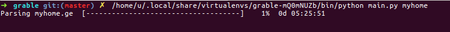

# This is a general web scraper project
#### currently scrapper scraps data from: www.myhome.ge

#requirements 
- Python 3.6 and above

#installation
in order to run script you need to install `pipenv`

```bash 
    pip instal pipenv
```
after that run this command:

```bash
    pipenv install
```
it will install all dependencies 

#usage
After everything is installed you can run following command:

```bash
    python main.py myhome
```

progress bar will show you script progression.




